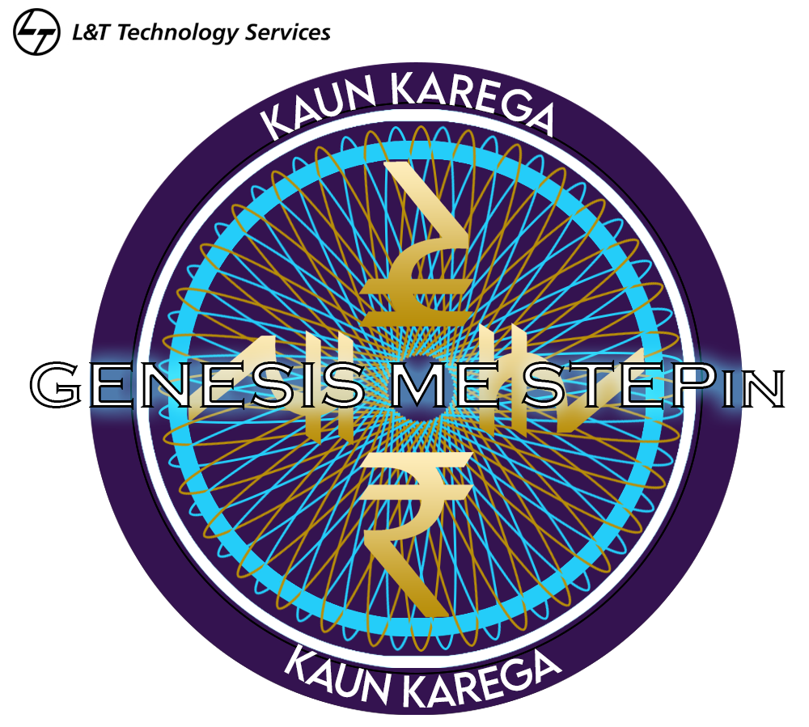

# Requirements
## Introduction
### KAUN KAREGA GENESIS ME STEPin! 
A fun C Programming based Quiz consisiting of questions from different genres, and a minimum score to grab an oppurtunity to be a part of the :fire: **Genesis                   Program** :fire:

## Research
* Content for the Quiz.
* File handling.

## Cost and Features
The quiz contains a file handling algorithm, where the questions are stored in a *.csv* file.

#### Format for the .csv file is
- Genre Name to be the filename
- Question No. 1
- Option A, Option B, Option C, Option D
- Correct Option for above question
and so on.

A score of the contestant is generated and a minimum criteria is to be passed to clear the quiz.

## Defining Our System
The Quiz comprises of 3 Genres
1. General Knowledge
2. L&T Company History
3. Fundamentals in C language

Each Genre contains **5 Questions**.

A Contestant has to appear for only *2 out of 3* rounds, and has to clear **3 out of 5 Questions per round**

## SWOT ANALYSIS

### Strengths
* The program is scalable in terms of number of genres to be added.
* and the scoring system adopted is fairly simple enabling easy calculation of winner.
### Weaknesses
* Program is not GUI based so every correct answer options needs to be typed.
### Oppurtunities
* Converting program into GUI based game.
* Option of monitoring and keeping the highest score.
### Threats
* None as of now!

# 4W&#39;s and 1&#39;H

## Who:
**Who are the stakeholders ?**

    1. Any person or a member of the STEPin program willing to take up the quiz and find out if he/she is GENESIS ready.
    2. The quiz is based on general concepts and not specific to any particular domain. 

## What:
**What does the project do ?**

    1. The project aims at a fun quiz program which is input/output based depicting the score of the participant.
    2. The participant has to qualifiy a minimum score.

## When:
**When will it get completed ?**

    The Project will be completed by ______.

## Where:
**Where is the project done ?**

    The Project is implemented on C program platform based on Input/Output.

## How:
**How to achieve the Target ?**

    To achieve the target
        1. A good knowledge in file handling in C is a must.
        2. Basic input output based functions
        3. Proficiency in Structures and pointers.

# Detailed requirements
## High Level Requirements:
| ID    | Description   | Remarks      | Implemented/Future |
|-------|---------------|--------------|--------------------|
| HLR1  | Questionnaire | in .csv file | Implemented        |
| HLR2  | Life Tracker  | function     | Implemented        |
| HLR3  | Dynamic Memory management| inbuilt| Implemented        |              
|    |                  |              |                    |

##  Low level Requirements:

| ID   | Description                  | High Level ID | Implemented/Future |
|------|------------------------------|---------------|--------------------|
| LLR1 | Data for questions           | HLR1          | Implemented        |
| LLR2 | csv File format and handling | HLR1          | Implemented        |
| LLR3 | Function for counting lives  | HLR2          | Implemented        |
| LLR4 | Array of structures          | HLR3          | Implemented        |