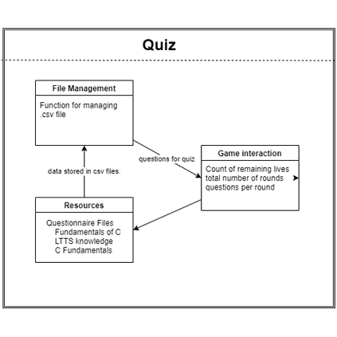
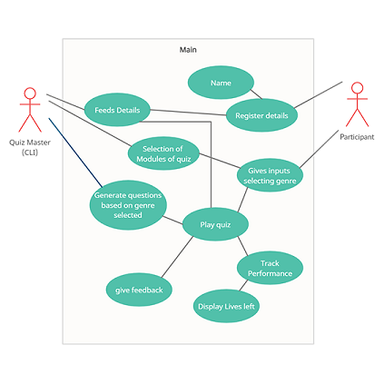
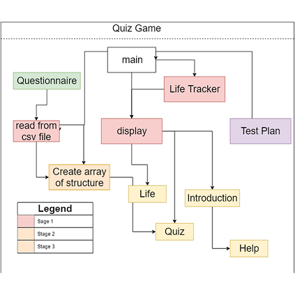
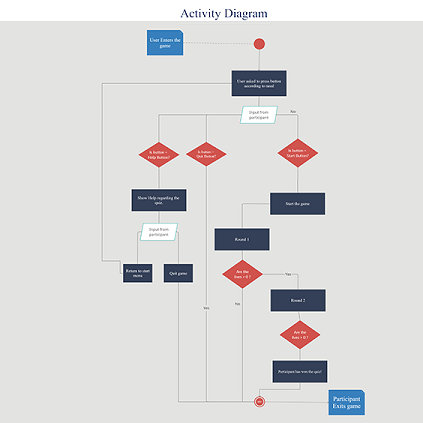

# Design

## High Level Design 

The __Component Diagram__ for the program is shown below, showing the structure of the program and how each component is linked with each other.

The __Use Case Diagram__ of the program is shown below, shows tbe High Level behavior of the program.

## Low Level Design 

The _basic_ low level __Structural Diagram__ of the porgram is shown below.

The __Activity Diagram__ for the porgram is shown, low level representation of the program based on different inputs. 

