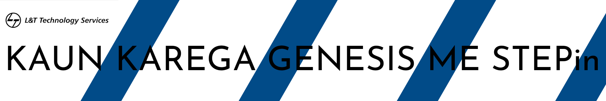

# MiniProject-STEPin
A Mini Project relevant to the STEPin training provided by L&amp;T Technology Services

### KAUN KAREGA GENESIS ME STEPin! 
A fun C Programming based Quiz consisiting of questions from different genres, and a minimum score to grab an oppurtunity to be a part of the :fire: **Genesis                   Program** :fire:

## Folder Structure
Folder             | Description
-------------------| -----------------------------------------
`1_Requirements`   | Documents detailing requirements and research
`2_Design`         | Documents specifying design details
`3_Implementation` | All code and documentation
`4_Test_plan`      | Documents with test plans and procedures

## Challenges Faced and How Was It Overcome

1. 
2. 
3. 

## Learning Resources
1. [Markdown Cheatsheet](https://github.com/adam-p/markdown-here/wiki/Markdown-Cheatsheet)
2. [Git Inspector](https://github.com/ejwa/gitinspector.git)
3. [GitGub workflow](https://docs.github.com/en/actions/learn-github-action)
4. [File Handling in C](link)